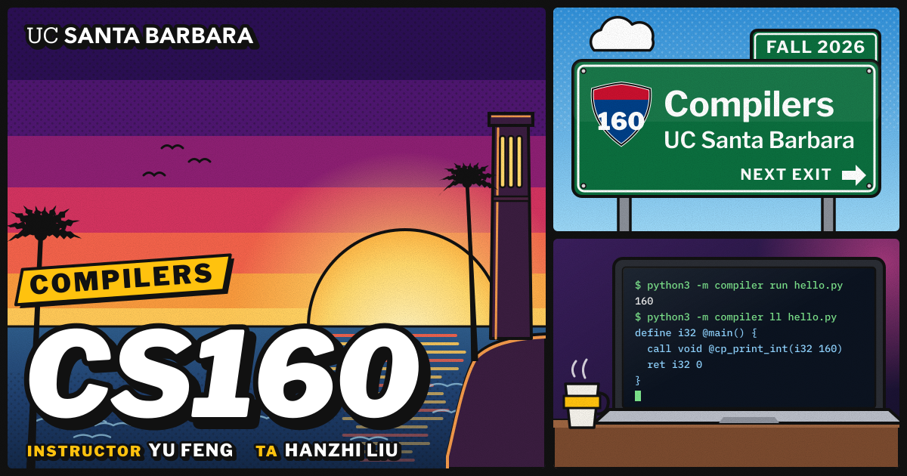

-----------------

[](https://github.com/trackoor/cs160-starter/actions/workflows/ci.yml)

This is the starter code of the ChocoPy compiler you build in [CS160 Compilers](https://github.com/fredfeng/CS160) at [UC Santa Barbara](https://www.cs.ucsb.edu). The compiler, written in Python, translates programs in the course's subset of [ChocoPy](https://chocopy.org), a statically typed subset of Python, into LLVM IR, which `clang` compiles together with a small C runtime into a native executable. This system was developed for educational purposes and should not be used in production environments.

Each of the six programming assignments adds to the same compiler. The assignment writeups are posted in the course repository under [`assignments/`](https://github.com/fredfeng/CS160/tree/main/assignments), and the language your compiler accepts is specified in [`chocopy/SPEC.md`](https://github.com/fredfeng/CS160/blob/main/chocopy/SPEC.md).

```console
$ echo 'print(160)' > hello.py
$ python3 -m compiler run hello.py
160
```

**WARNING: DO NOT DIRECTLY FORK THIS REPO. DO NOT PUSH ASSIGNMENT SOLUTIONS PUBLICLY. THIS IS AN ACADEMIC INTEGRITY VIOLATION UNDER THE [UCSB ACADEMIC INTEGRITY POLICY](https://studentconduct.sa.ucsb.edu/academic-integrity), AND SO IS SHARING YOUR SOLUTION IN ANY OTHER WAY.**

## Getting the Starter Code

Each assignment comes through [OneWorld](https://oneworldai.com). Its page, which the course staff send you, has three steps:

1. Install or update the `oneworld` command line. Run it again for each assignment.
2. Join the assignment: `oneworld assessment join` with its invite code. It downloads this starter code, as released for that assignment, into a new folder, a git repository of its own, and leaves you there. Work in that folder until you hand the assignment in.
3. Hand it in: `oneworld assessment submit`, in that folder. It sends what you changed and, if you use AI, your sessions.

From PA2 on, bring your work from the folder of the previous assignment into the new one:

```console
$ python3 tools/carry.py ../previous-folder
```

It copies the modules you wrote in `compiler/`, your tests in `test/mine/` and your design documents, and never a file the course provides. Each writeup gives the details, starting with PA0.

To keep a backup of your work on GitHub, push your folder to a **private** repository of your own.

## Build

You can develop your compiler on macOS, on Linux, or on Windows inside WSL 2. Grading runs on Linux.

### Linux / macOS

To ensure that you have the proper packages on your machine, run the following script to automatically install them:

```console
# Linux
$ sudo build_support/packages.sh
# macOS
$ build_support/packages.sh
```

It installs Python, clang, and the `ruff` formatter and linter. Then check that everything works:

```console
$ python3 tools/doctor.py
```

Your compiler needs no build step. To compile and run a program:

```console
$ python3 -m compiler run prog.py
```

To print the LLVM IR instead, use `python3 -m compiler ll prog.py`; `python3 -m compiler --help` lists every command. To run the tests of every assignment released so far, together with your own tests in `test/mine`:

```console
$ make check-tests
```

Each writeup describes the tests, the design document and the submission of its assignment.

There are some differences between macOS and Linux (e.g., Apple's clang compiles LLVM IR that is not in valid SSA form, which LLVM's own verifier would reject) that might cause test cases to produce different results on different platforms. Check your IR with `--verify` (for example `python3 tools/difftest.py --verify test/pa1`), and use a Linux machine to reproduce a result from the grading environment whenever possible.
